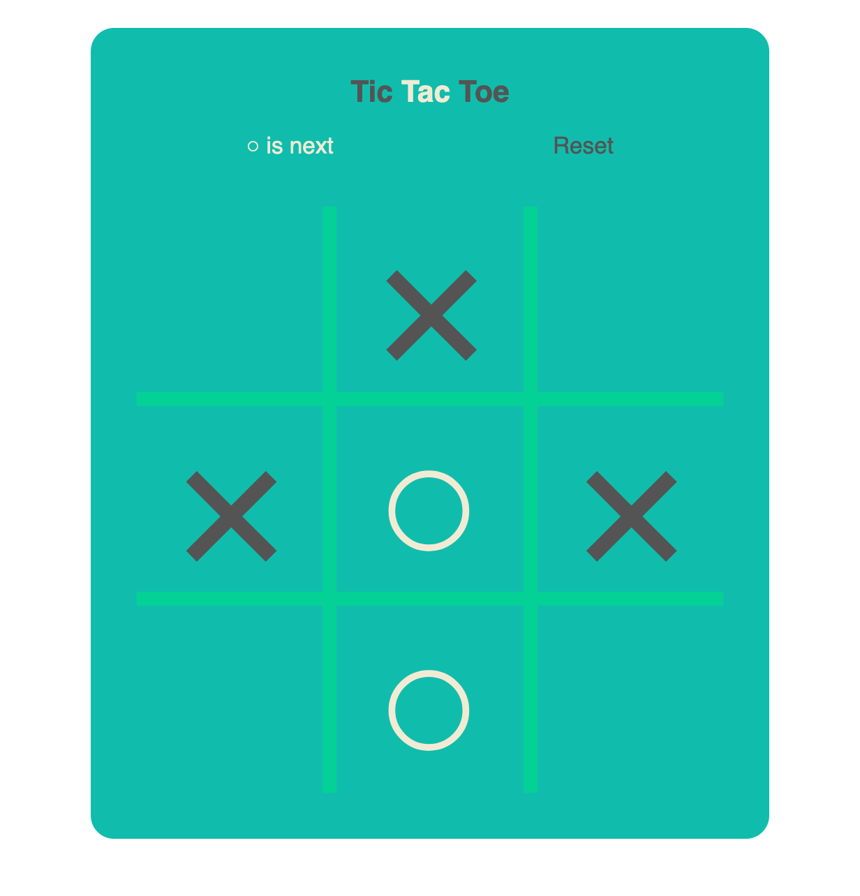

# Tic Tac Toe game for 2 players

First project in General Assembly Software Engineering Immersive course.

## Screenshot of the app

## Getting Started

Tic-tac-toe (American English), noughts and crosses (British English), or Xs and Os is a paper-and-pencil game for two players,X and O, who take turns marking the spaces in a 3×3 grid.

Player 1 and player 2 taking turns to play

Player 1 clicks a box and mark it with ‘O’

Player 2 clicks a box and mark it with ‘X’

The player who succeeds in placing three of their marks in a horizontal, vertical, or diagonal row is the winner.

### Deployment

- Github
- https://hayley0918.github.io/03-project1-Tic-Tac-Toe/

### Built with

- HTML
- CSS
- JavaScript

